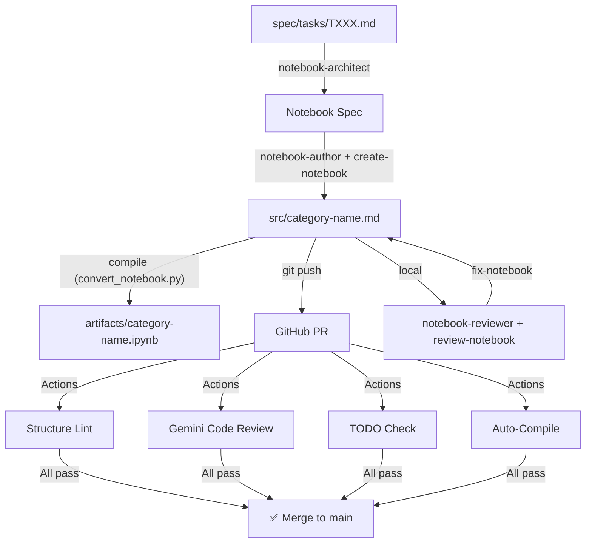
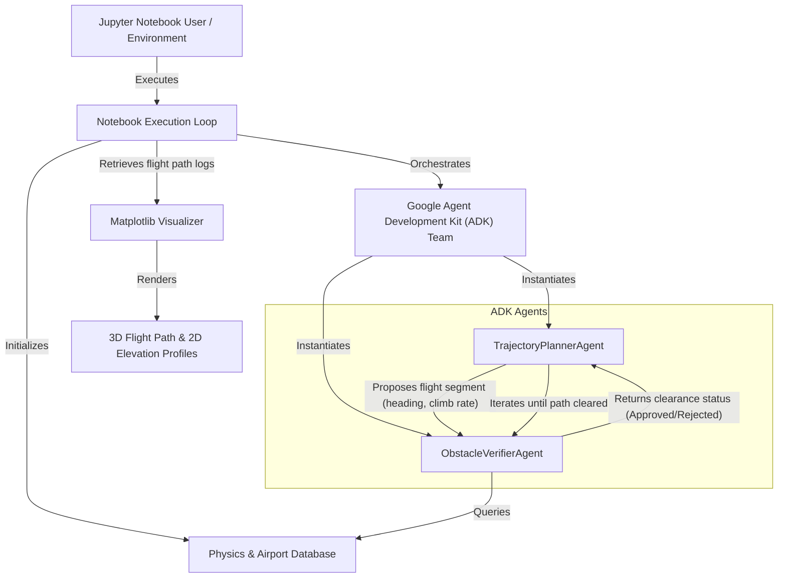

# Architecture — Repository Design

## Overview
A flat notebook repository with a spec-driven authoring workflow.
Notebooks live in `src/` following a `category-name.md` naming convention, and compile to `artifacts/category-name.ipynb` for final delivery.
Quality is enforced through local agent-assisted workflows and automated GitHub Actions.

## Architecture Diagram

## Components

### Notebook Template
- **Responsibility**: Define the canonical structure for all workshop notebooks
- **Technology**: Markdown (.md)
- **Location**: `notebook_template.md` (root)
- **Data**: Section structure, license header, parameterized variables

### Artifacts Directory
- **Responsibility**: Hold final compiled `.ipynb` notebooks for workshop delivery
- **Technology**: Jupyter Notebook (.ipynb)
- **Location**: `artifacts/`

### Agent Framework
- **Responsibility**: Provide AI-assisted development lifecycle
- **Technology**: Markdown-based agent definitions (tool-agnostic)
- **Location**: `.agents/`
- **Components**: personas, skills, workflows, rules, memory

### GitHub Actions
- **Responsibility**: Automated quality enforcement and notebook compilation on PRs
- **Technology**: GitHub Actions + Python scripts + Gemini API
- **Location**: `.github/workflows/`, `.github/scripts/`
- **Triggers**: PR events modifying `.md` files in `src/`

### Spec Directory
- **Responsibility**: Track notebook authoring standards and task specs
- **Technology**: Markdown files in EARS notation
- **Location**: `spec/`

## Data Flow
1. Author creates a task spec in `spec/tasks/`
2. Agent generates notebook from template into `src/` as a `.md` file
3. Author fills in content with agent assistance in markdown
4. Local compilation to `artifacts/` and review via `review-notebook` skill
5. Push to GitHub triggers automated checks and auto-compiles updated `.ipynb` notebooks
6. PR approved and merged to `main`

## Constraints
- All notebooks must follow the template structure
- Python 3.10+ compatibility required
- Notebooks must not contain hardcoded credentials
- Apache 2.0 license header required on all notebooks

## Evolution Plan
- Future: Add notebook execution tests in CI (requires GCP credentials management)
- Future: Add workshop scheduling and attendee tracking
- Future: Multi-language notebook support

---

# Notebook Architecture — Autonomous EOSID Trajectory Generation

## Component Diagram

## Notebook Specific Data Flow
1. **Aircraft Specs & Environment Setup**: The user inputs aircraft takeoff weight, thrust loss parameters, and airport database selection.
2. **Path Negotiation**:
   - `TrajectoryPlannerAgent` creates a candidate segment list starting from the departure runway.
   - For each segment, the agent queries the `ObstacleVerifierAgent`.
   - The verifier computes whether the aircraft OEI climb gradient clears local peak heights plus a safety margin.
   - If clearance is violated, the verifier suggests a directional change.
   - The planner generates a new flight path heading/turn point.
3. **Flight Path Finalization**: Once the full trajectory reaches the safe altitude threshold, the agent team exits and returns the coordinate list.
4. **Rendering**: The notebook extracts coordinate arrays and graphs them.

